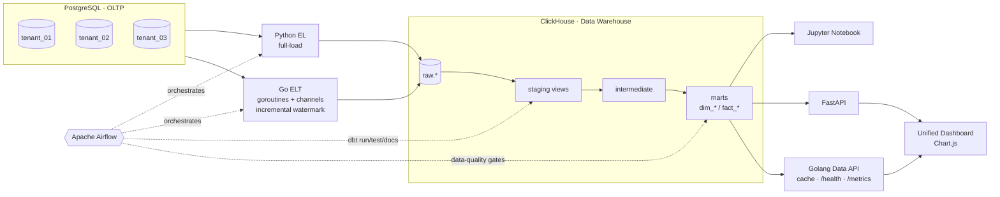

# Minimarket POS — End-to-End Data Pipeline

End-to-end ELT for a **Minimarket Point-of-Sale** system: extract from
PostgreSQL (OLTP) → load into ClickHouse (data warehouse) → transform with
**dbt** into a dimensional star schema → orchestrate with **Apache Airflow** →
serve via APIs → visualize.

The whole stack runs locally with Docker Compose — no cloud credentials needed.

### Highlights

- **Multi-tenant ingestion** — 3 source tenants loaded concurrently (Go goroutines + channels, fan-out/fan-in).
- **Full-load and incremental** EL — incremental uses a per-`(tenant, table)` high-watermark (file- and DWH-table-backed).
- **dbt star schema** — `staging → intermediate → marts` (`dim_*` / `fact_*`), with custom macros for surrogate keys, date keys and audit columns.
- **3-layer data quality** — raw row-count reconciliation against the source, plus staging and mart dbt tests, wired as **fail-fast gates** in Airflow.
- **Two serving layers** — a FastAPI service and a dependency-free **Golang Data API** (in-memory cache, request-logging middleware, `/health`, `/metrics`).
- **Unified dashboard** — a single Chart.js page (12 charts incl. a cohort-retention heatmap) plus an exploratory Jupyter notebook.
- **Tested** — Go and Python unit tests, dbt data tests, and `dbt docs`.

### Components

| Component | Tech | Role |
|-----------|------|------|
| Extract & Load | Python (`psycopg2` + `clickhouse-connect`), Go (goroutines + channels) | Pull OLTP → land in ClickHouse `raw.*`; full-load and incremental modes |
| Transform | dbt Core (ClickHouse adapter) | `staging` → `intermediate` → `marts` (star schema) |
| Orchestration | Apache Airflow | EL → dbt run/test/docs, with data-quality gates |
| Data quality | dbt tests + row-count reconciliation | 3-layer checks, fail-fast |
| Serving | FastAPI + Golang Data API | JSON analytics endpoints (cache, `/health`, `/metrics`) |
| Visualization | Jupyter Notebook + Chart.js | exploratory analysis + a 12-chart dashboard |

---

## Architecture



### Star schema (marts)

```
                 ┌──────────────┐
                 │  dim_date    │
                 └──────┬───────┘
                        │
┌──────────────┐   ┌────▼─────────┐   ┌──────────────┐
│ dim_customer ├───┤  fact_sales  ├───┤ dim_product  │
└──────────────┘   └───┬──────┬───┘   └──────────────┘
                       │      │
              ┌────────▼─┐  ┌─▼─────────────┐   ┌──────────────┐
              │ dim_store│  │ fact_promotion│───│ dim_promotion│
              └──────────┘  │ _usage        │   └──────────────┘
                            └───────────────┘
```

The warehouse also carries `dim_employee`, `dim_supplier`, `dim_loyalty_tier`,
`fact_inventory_movement` and `fact_loyalty_activity`, fed by an enriched
intermediate layer (`int_sales_enriched`) that joins product cost so margin is
available to the marts without re-joining.

---

## Repository structure

```
end-to-end-de-platform/
├── docker-compose.yml          # Postgres, ClickHouse, Airflow, APIs, dashboard, build images
├── .env.example                # copy to .env
├── script/
│   ├── run_seed.sh             # populate the source database with sample data
│   ├── init/01_schema.sql      # OLTP DDL (3 tenant schemas)
│   ├── seed/generate_seed.py   # Faker data generator
│   └── clickhouse-init/        # create the raw + analytics databases
├── pipeline/
│   ├── python/                 # Python EL (full-load) + raw-layer DQ (dq_raw.py) (+ unit tests)
│   └── golang/                 # Go ELT — goroutines + channel fan-out/fan-in,
│       │                       #   rate limiting, incremental watermark (+ unit tests)
│       └── config/tenants.json
├── dbt/                        # dbt Core (ClickHouse): staging + intermediate + marts + tests
│   └── Dockerfile              # transform image (dbt + raw-DQ), run via Airflow DockerOperator
├── airflow/dags/               # Airflow DAG definitions
├── analytics/analysis.ipynb    # exploratory notebook
├── api/                        # FastAPI service (JSON analytics endpoints)
├── go-api/                     # Golang Data API (cache, /health, /metrics)
└── dashboard/                  # Unified HTML + Chart.js dashboard (12 charts)
```

---

## Prerequisites

- Docker + Docker Compose
- (Optional, for the notebook or running code outside Docker) Python 3.11, Go 1.21, `psql`

---

## Quick start

```bash
# 1. create your environment file
cp .env.example .env

# 2. start the stack (Postgres, ClickHouse, Airflow, APIs, dashboard)
docker compose up -d --build

# 3. build the pipeline images Airflow launches via DockerOperator
docker compose build elt dbt

# 4. seed the source database with sample data
docker compose run --rm seed        # or, from the host: ./script/run_seed.sh

# 5. (optional) launch the exploratory notebook in a virtualenv
python -m venv .venv && source .venv/bin/activate
pip install -r analytics/requirements.txt
jupyter notebook analytics/analysis.ipynb

# 6. open Airflow, enable a DAG, and trigger it
#    http://localhost:8081   (user: admin / pass: admin)
```

### Service URLs

| Service | URL | Notes |
|---------|-----|-------|
| Airflow | http://localhost:8081 | admin / admin |
| Unified dashboard | http://localhost:8080 | 12 charts (incl. cohort heatmap) |
| FastAPI | http://localhost:8000/docs | JSON analytics endpoints |
| Golang Data API | http://localhost:8090/ | JSON endpoints, `/health`, `/metrics` |
| Jupyter Notebook | http://localhost:8888 | exploratory analysis (launched in step 5) |
| ClickHouse HTTP | http://localhost:8123 | user `default` / pass `clickhouse` |
| PostgreSQL | localhost:5432 | db `pos`, user `pos_user` |

> **DockerOperator note:** the data-quality DAG launches each layer as a sibling
> container through the host Docker daemon, so the Airflow scheduler mounts
> `/var/run/docker.sock` and the task containers join the
> `end-to-end-de-platform_default` compose network to reach `postgres` / `clickhouse` by
> name. On Linux the scheduler may need access to the docker socket group.

---

## Running the pipeline

Everything runs from the **Airflow UI** at http://localhost:8081 (admin / admin).
Open a DAG, toggle it **on**, and click **▶ Trigger**. Watch progress in the
Grid / Graph view; task logs are available per task.

The project ships three end-to-end DAGs that share the same warehouse and dbt
project — pick the one that matches how you want to ingest:

| DAG | Ingestion | Orchestration |
|-----|-----------|---------------|
| `beginner_pipeline` | single-tenant **full-load** (Python) | `EL → dbt run → dbt test` |
| `intermediate_pipeline` | multi-tenant **incremental** (Go goroutines) | `EL → dbt run → dbt test → dbt docs` |
| `advanced_pipeline` | multi-tenant **incremental** (Go fan-out/fan-in), each stage in its own container via `DockerOperator` | `EL → DQ gate → dbt → DQ gate → … → dbt docs` |

The `advanced_pipeline` adds a **fail-fast data-quality gate after every layer** —
a broken layer stops the run before the next one is built:

```
elt → dq_raw → dbt staging → dq_staging → dbt marts → dq_marts → dbt docs
```

- **`dq_raw`** reconciles every `raw.*` row count against PostgreSQL — the one
  check dbt can't do, since dbt only sees the warehouse. The run fails if any
  table landed short.
- **`dq_staging` / `dq_marts`** run the dbt tests scoped to each layer (staging
  uses cautious indirect selection so mart-dependent tests don't run before the
  marts exist).

Once a pipeline has run, the **dashboard** (http://localhost:8080) and both APIs
serve live results.

---

## Analytics & visualization

The unified dashboard at http://localhost:8080 renders **12 charts** from two
serving layers on a single page, and `analytics/analysis.ipynb` provides an
exploratory notebook that connects directly to ClickHouse.

**FastAPI endpoints**

| Endpoint | Analysis |
|----------|----------|
| `/api/revenue-by-store` | Revenue per store per month (last 6 months) |
| `/api/promotion-effectiveness` | Discount per promo + avg txn value with/without promo |
| `/api/top-products-by-city` | Top 3 products by revenue per city |
| `/api/customer-segments` | High/Medium/Low spender segmentation per city |
| `/api/transactions-by-day` | Transactions & revenue by day of week |

**Golang Data API endpoints** (`/api/v1/*`)

| Endpoint | Analysis | Chart |
|----------|----------|-------|
| `/api/v1/revenue-margin` | Revenue & estimated margin per category per quarter | stacked bar |
| `/api/v1/customer-ltv` | Top customers by lifetime value + loyalty tier | horizontal bar |
| `/api/v1/inventory-turnover` | Inventory turnover per store×product (slow movers) | horizontal bar |
| `/api/v1/employee-performance` | Avg transaction value, revenue & margin per cashier | horizontal bar |
| `/api/v1/promotion-roi` | (Incremental revenue vs baseline) / total discount | horizontal bar |
| `/api/v1/supplier-dependency` | Single- vs multi-source dependency for top sellers | horizontal bar |
| `/api/v1/cohort-retention` | % of each monthly cohort still active N months later | **heatmap** |

The Go API caches each response in memory (TTL via `CACHE_TTL_SECONDS`, default
60s — see the `X-Cache: HIT/MISS` header), logs every request, and exposes
`/health` (warehouse connectivity) and `/metrics` (Prometheus text: requests,
errors, cache hits/misses).

The notebook covers top products per category, the monthly revenue trend, and the
payment-method mix.

---

## Incremental load

The Go loader keeps a per-`(tenant, table)` **high-watermark** on `updated_at`,
persisted to `state/watermark.json`. Each run only pulls rows changed since the
last watermark. ClickHouse `ReplacingMergeTree(updated_at)` keyed by
`(tenant_id, pk)` keeps the latest version; staging models read with `FINAL`.

The fan-out/fan-in loader persists the watermark in a DWH config table
(`raw.etl_watermark`) instead of a local JSON file, and only advances it after a
fully successful per-tenant load, so a failed run safely re-pulls the same window
on retry.

---

## Tests

```bash
# Python unit tests
cd pipeline/python && pip install -r requirements.txt pytest && pytest

# Go unit tests
cd pipeline/golang && go test ./...

# dbt data tests (not_null / unique / relationships / accepted_values + singular DQ)
docker compose exec airflow-scheduler bash -lc 'dbt test'
```

The 3-layer DQ strategy: **raw** = row-count reconciliation against the source
(`dq_raw.py`); **staging** = `not_null` on critical columns + source freshness;
**marts** = `unique` / `not_null` / `relationships` / `accepted_values` plus two
singular tests (revenue reconciliation `fact_sales` ↔ staging, and a
freshness/SLA check on `dbt_loaded_at`).

---

## Notes & design decisions

- An `updated_at` column is present on every OLTP table to enable a clean
  incremental watermark.
- All dbt models live in the single ClickHouse `analytics` database and are
  distinguished by naming convention (`stg_` / `dim_` / `fact_`), since
  ClickHouse databases don't map 1:1 to SQL schemas.
- Surrogate keys are tenant-scoped (`tenant_id` + natural id) to avoid
  collisions across tenants.
- Tenancy is simulated with 3 PostgreSQL schemas in one instance; the loader
  treats each as an independent source.
```
